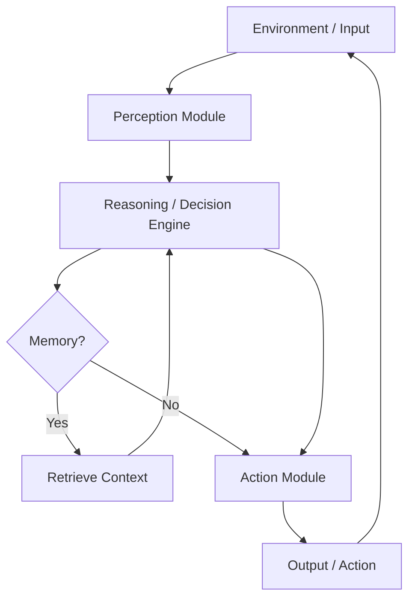
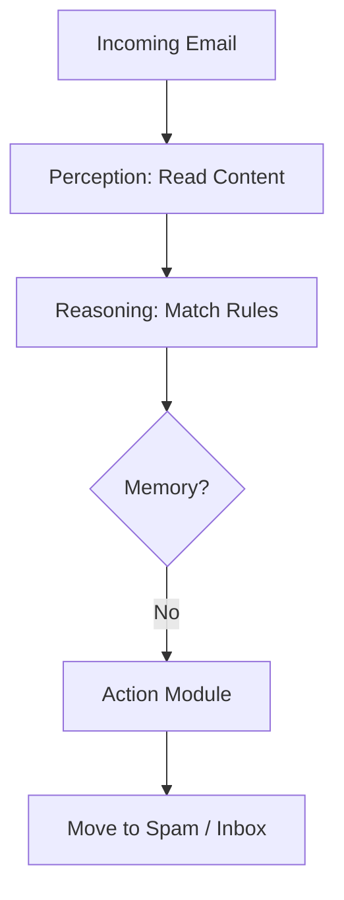
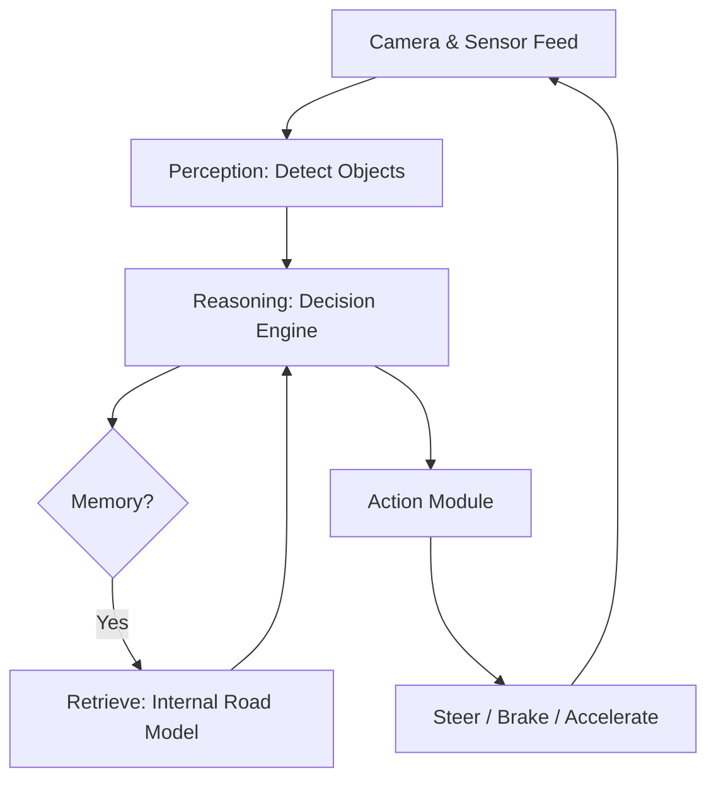
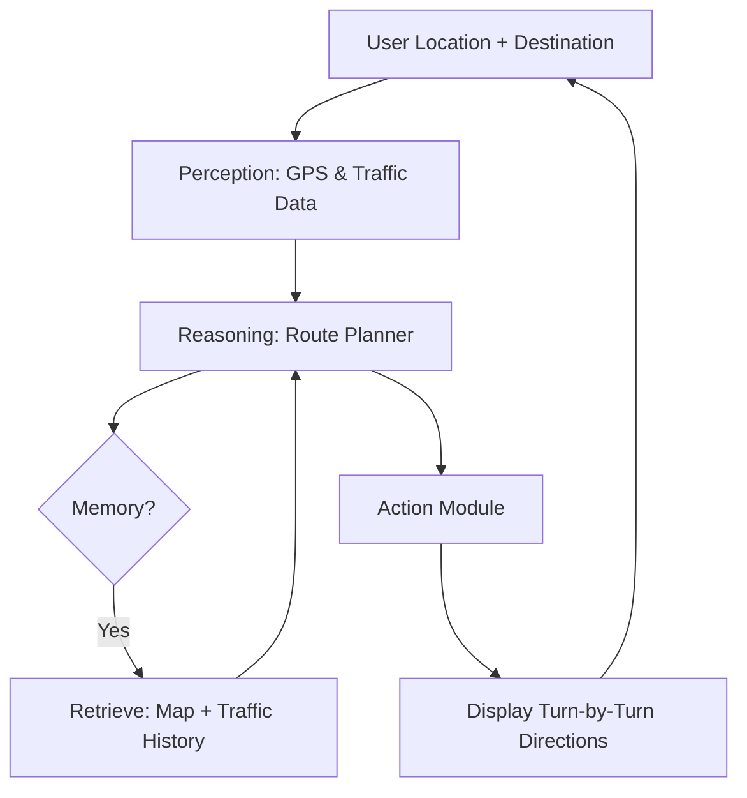
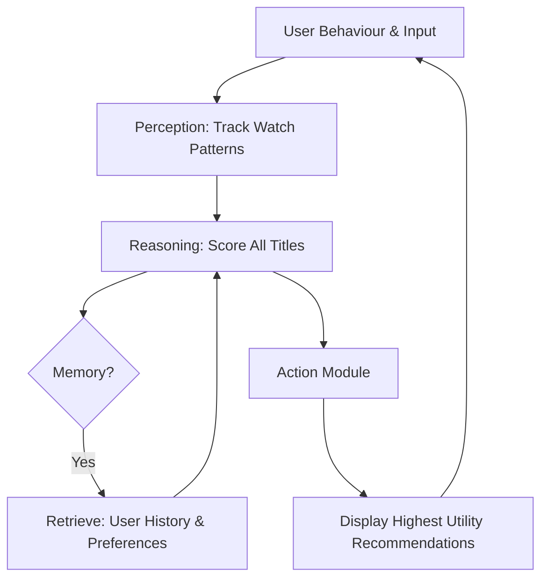
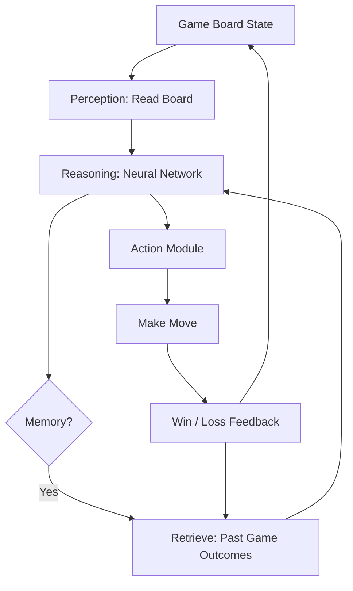
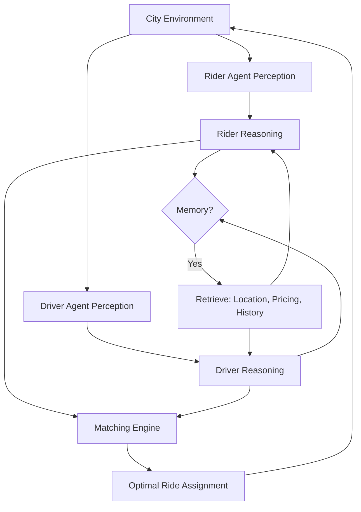
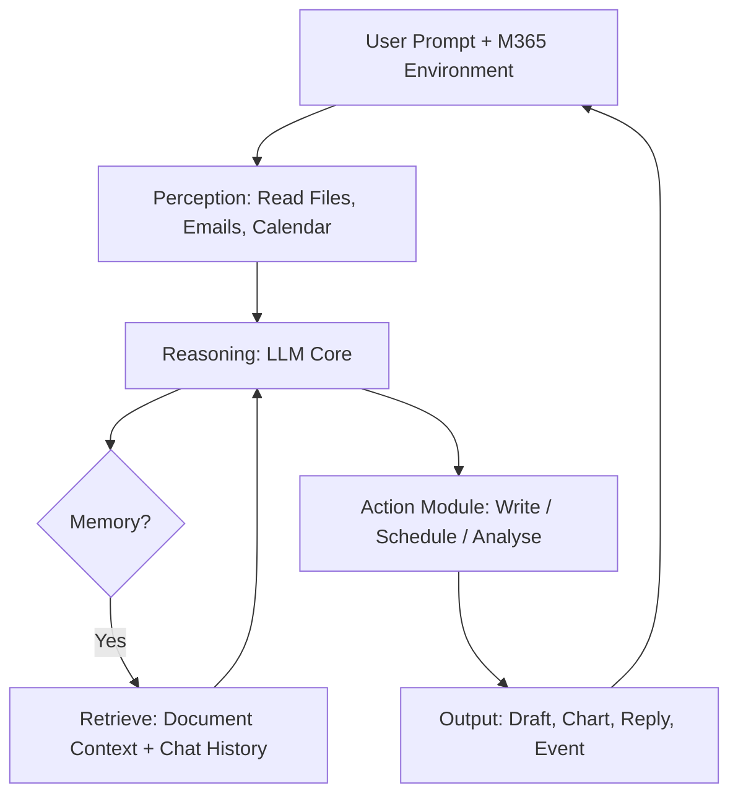

# AI Agent Categories — Real-World Product Examples

---

## Agent Architecture Overview

> Understanding how **all agents fundamentally operate** before diving into each type:



> **Every agent below follows this loop** — what differs is *how sophisticated* each layer is.

---

### 1. Simple Reflex Agents

**Product: Google Spam Filter (Gmail)**


- **What it does**: Scans every incoming email and **immediately routes it** to spam or inbox based on fixed rule patterns (keywords, sender reputation, formatting)
- **Why it fits**: No memory of past emails — every message is judged **independently** in real time
- **Rule logic**: `IF email contains "click here to claim prize" → THEN move to spam`

**Architecture in this context:**


---

### 2. Model-Based Reflex Agents

**Product: Tesla Autopilot**


- **What it does**: Maintains a **real-time internal model** of the road — including vehicles, lane markings, and obstacles — even when sensors are temporarily blocked
- **Why it fits**: It doesn't just react to what it *currently sees*; it tracks what it **last knew** about surrounding cars and predicts their positions
- **Example**: If a car moves behind a truck and disappears from view, Tesla still **models its likely position** to avoid a collision

**Architecture in this context:**


---

### 3. Goal-Based Agents

**Product: Google Maps (Navigation Mode)**


- **What it does**: Given a **destination (goal)**, it evaluates thousands of possible routes and selects the optimal path using real-time data
- **Why it fits**: Every decision — turn left, take the motorway, reroute — is driven by the single goal of **reaching the destination efficiently**
- **Goal chain**:
```
Goal: Arrive at destination in shortest time
  → Evaluate all routes
  → Select best sequence of turns
  → Re-plan if road conditions change
```

**Architecture in this context:**


---

### 4. Utility-Based Agents

**Product: Netflix Recommendation Engine**


- **What it does**: Assigns a **utility score** to thousands of titles based on your watch history, ratings, time of day, and device — then surfaces the content with the **highest predicted satisfaction**
- **Why it fits**: It doesn't just find *a* show you might like — it finds the **best possible** show by maximising an internal utility function
- **Utility function considers**:
  - Time spent watching similar content
  - Implicit ratings (rewatch, pause, skip)
  - Behaviour of similar user profiles

**Architecture in this context:**


---

### 5. Learning Agents

**Product: DeepMind AlphaGo / AlphaZero**


- **What it does**: Learns to play board games (Go, Chess, Shogi) **from scratch** using reinforcement learning — playing millions of games against itself to improve
- **Why it fits**: It starts with **zero human knowledge** (AlphaZero) and progressively refines its strategy purely through experience and feedback
- **Achievement**: Defeated world Go champion Lee Sedol in 2016 — a milestone once thought **decades away**

**Architecture in this context:**


> Notice the **extra feedback arrow** — this is what makes it a *learning* agent!

---

### 6. Multi-Agent Systems

**Product: Uber's Ride-Matching Platform**


- **What it does**: Thousands of **driver agents** and **rider agents** operate simultaneously, negotiating assignments, routing, and pricing in real time across a city
- **Why it fits**: No single central agent controls everything — **distributed agents** collaborate and compete to optimise supply-demand balance

**Architecture in this context:**


---

### 7. LLM-Powered Agents

**Product: Microsoft Copilot (in Microsoft 365)**


- **What it does**: Acts as an **intelligent assistant** embedded across Word, Excel, Outlook, and Teams — reasoning, writing, summarising, generating formulas, and taking actions on your behalf
- **Why it fits**: Uses an LLM as its **reasoning core**, combined with tools (file access, calendar, email) and memory (document context) to complete complex multi-step tasks

| Task | What Copilot Does |
|---|---|
| "Summarise my inbox" | Reads emails, extracts key points, drafts replies |
| "Analyse this sales data" | Reads Excel sheet, generates charts & insights |
| "Write a project brief" | Uses context from past docs to draft new content |
| "Schedule a meeting" | Checks calendars of all attendees & books a slot |

**Architecture in this context:**


---

## Full Summary Table

| # | Agent Type | Real-World Product | Memory | Learning | Architecture Highlight |
|---|---|---|---|---|---|
| 1 | Simple Reflex | **Gmail Spam Filter** | No | No | No memory loop |
| 2 | Model-Based | **Tesla Autopilot** | Yes | No | Internal world model |
| 3 | Goal-Based | **Google Maps** | Yes | No | Goal-driven replanning |
| 4 | Utility-Based | **Netflix** | Yes | No | Utility maximisation |
| 5 | Learning | **AlphaGo / AlphaZero** | Yes | Yes | Feedback loop updates memory |
| 6 | Multi-Agent | **Uber Platform** | Yes | Yes | Distributed agent coordination |
| 7 | LLM-Powered | **Microsoft Copilot** | Yes | Yes | Full architecture + tool use |

---

> **Presentation Tip**: Use the **individual architecture diagrams** per slide to visually show your audience *how each agent type evolves in complexity* — from a simple one-way flow to a full feedback-driven loop!
